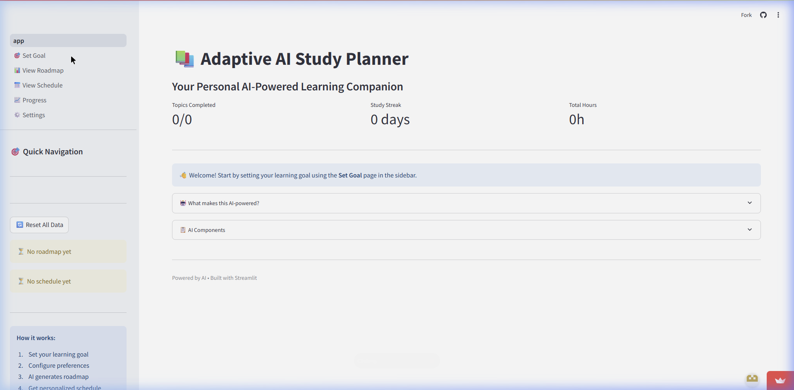
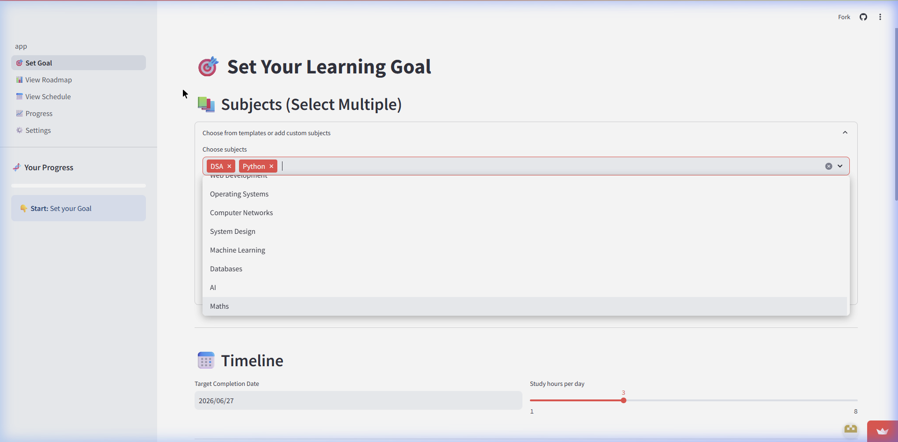
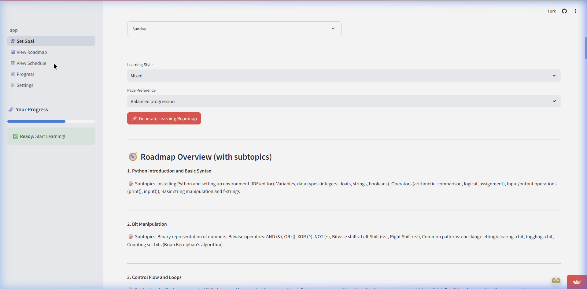
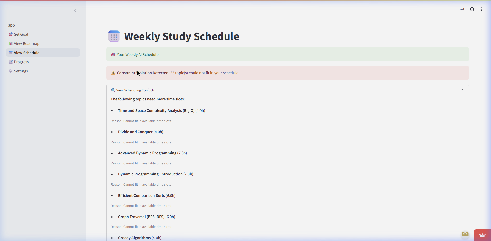

# 📚 Adaptive AI Study Planner

🔗 **Live Demo:** [ai-adaptive-study-planner.streamlit.app](https://ai-adaptive-study-planner.streamlit.app/)

An AI-powered study planning system that generates **personalized learning paths** and **adaptive weekly schedules** using A* search, constraint-based scheduling (CSP), rule-based reasoning, and LLM-driven curriculum generation.

---

## 📸 Screenshots

### 🏠 Dashboard
> Clean landing page with progress metrics, quick navigation, and AI component overview.



### 🎯 Set Your Learning Goal
> Select subjects, set deadlines, configure study preferences, and choose available time slots.



### 🧭 AI-Generated Roadmap with Subtopics
> The LLM generates a structured curriculum with detailed subtopics for each topic.



### 📅 Constraint-Aware Scheduling
> The CSP scheduler detects conflicts when topics can't fit in available time slots and reports them transparently.



---

## ✨ Features

- **🤖 LLM Curriculum Generation** — Gemini AI generates structured topic breakdowns with subtopics
- **🔍 A\* Search Pathfinding** — Finds the optimal study order respecting prerequisites
- **📅 CSP Scheduling** — Multi-week constraint-based scheduling with slot capacity management
- **🧠 Rule-Based Reasoning** — 5 priority rules (deadline urgency, difficulty matching, prerequisite unlocking, spaced repetition, learning style)
- **🔄 Meta-Reasoning** — Fatigue filter prevents back-to-back hard topics
- **⚖️ Ethics Guard** — Prevents burnout with health constraint validation (backed by research)
- **💬 Explainable AI** — Real-time "Agent Thoughts" sidebar shows AI decision-making
- **💾 Persistent State** — SQLite-backed session continuity across app restarts
- **📊 Progress Tracking** — Track completed topics with confidence ratings

---

## 🏗️ Architecture

```
User Input → Ethics Check → LLM Curriculum → Knowledge Graph (DAG)
    → Rule-Based Reasoning → A* Optimal Path → Meta-Reasoning (Fatigue Filter)
    → CSP Multi-Week Scheduler → Interactive Dashboard
```

> For detailed architecture and algorithm documentation, see:
> - [ARCHITECTURE.md](ARCHITECTURE.md) — System design, data flow, and layer breakdown
> - [AI_COMPONENTS.md](AI_COMPONENTS.md) — Deep dive into each AI module
> - [ETHICS.md](ETHICS.md) — Ethical AI design principles and health constraints

---

## 🛠️ Tech Stack

| Category | Technologies |
|----------|-------------|
| **Frontend** | Streamlit, streamlit-agraph |
| **AI/ML** | Google Gemini API, Custom A* Search, Rule-Based Reasoner |
| **Graph** | NetworkX (Directed Acyclic Graph) |
| **Scheduling** | Constraint Satisfaction Problem (CSP) solver |
| **Database** | SQLAlchemy + SQLite |
| **Visualization** | Plotly, Pandas |

---

## 🚀 Run Locally

1. **Clone the repository**
   ```bash
   git clone https://github.com/devgupta111/Ai-Adaptive-Study-Planner.git
   cd Ai-Adaptive-Study-Planner
   ```

2. **Install dependencies**
   ```bash
   pip install -r requirements.txt
   ```

3. **Set up environment variables**
   
   Create a `.env` file in the project root:
   ```
   GEMINI_API_KEY=your_gemini_api_key_here
   ```
   > Get your API key from [Google AI Studio](https://aistudio.google.com/apikey)
   > 
   > The app works without an API key too — it falls back to template-based curriculum generation.

4. **Run the app**
   ```bash
   streamlit run app.py
   ```

---

## 📁 Project Structure

```
├── app.py                    # Main Streamlit app (landing page)
├── pages/
│   ├── 1_🎯_Set_Goal.py      # Goal input + AI pipeline trigger
│   ├── 2_📊_View_Roadmap.py   # Interactive dependency graph
│   ├── 3_📅_View_Schedule.py  # Multi-week schedule display
│   ├── 4_📈_Progress.py       # Progress tracking & analytics
│   └── 5_⚙️_Settings.py      # Configuration & API keys
├── backend/
│   ├── llm_helper.py         # Gemini LLM integration
│   ├── state_graph.py        # NetworkX knowledge graph
│   ├── reasoner.py           # Rule-based priority engine
│   ├── a_star_planner.py     # A* search algorithm
│   ├── meta_reasoner.py      # Fatigue filter & meta-reasoning
│   ├── scheduler.py          # CSP multi-week scheduler
│   ├── ethics.py             # Health constraint validator
│   ├── user_model.py         # User preference model
│   ├── topic_model.py        # Topic data model
│   └── db.py                 # SQLAlchemy persistence layer
├── docs/                     # Additional documentation
├── screenshots/              # App screenshots
├── requirements.txt          # Python dependencies
├── AI_COMPONENTS.md          # Detailed AI module documentation
├── ARCHITECTURE.md           # System architecture documentation
└── ETHICS.md                 # Ethical AI design principles
```

---

## 📄 License

This project is for educational purposes.
